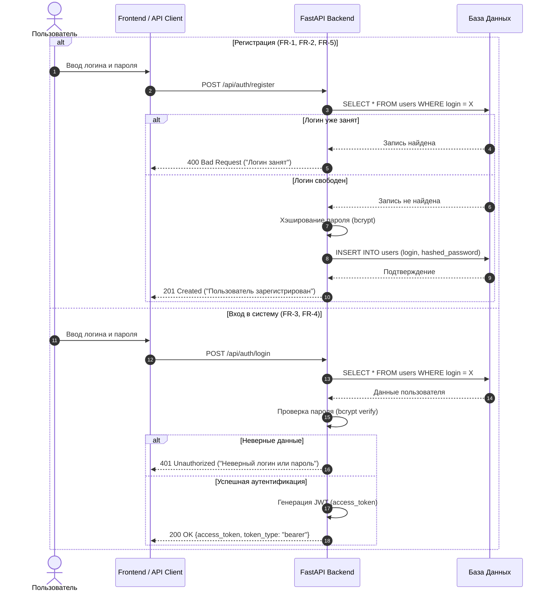
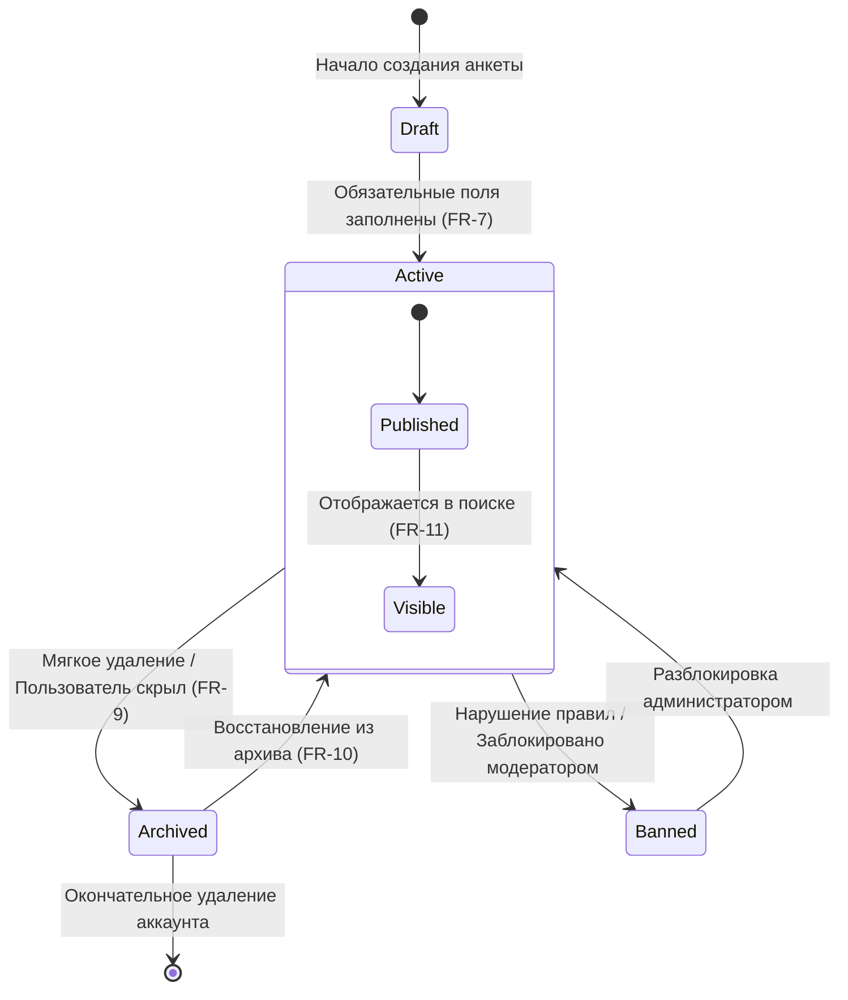
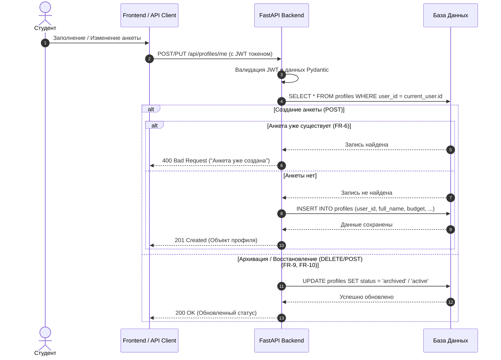
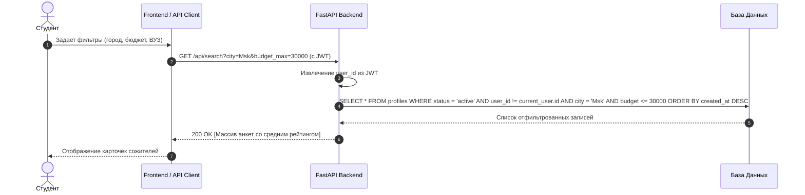
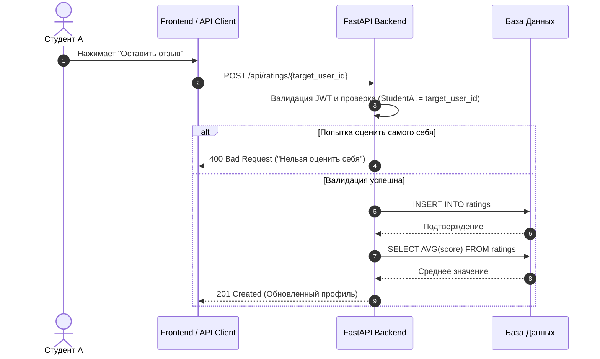
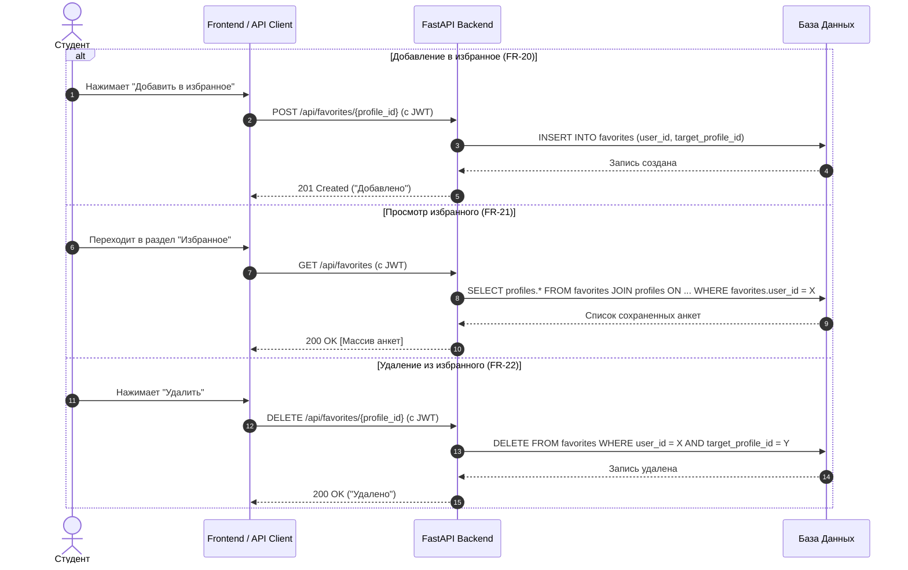
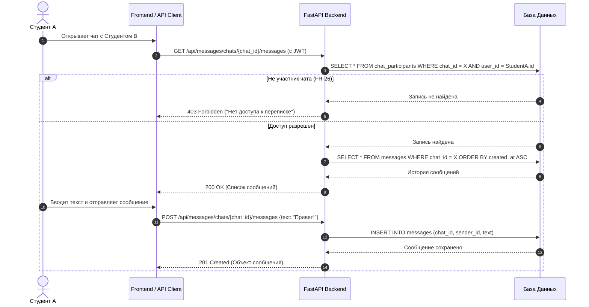

Функции системы

3.1 Модуль аутентификации и авторизации

3.1.1 Описание

Обеспечивает регистрацию новых пользователей, безопасно сохраняет учетные данные, аутентифицирует пользователей в системе и выдает маркеры доступа (JWT) для защиты закрытых эндпоинтов API.

3.1.2 Функциональные требования

FR-1: Система должна предоставлять регистрацию по логину и паролю.

FR-2: Пароль пользователя должен хэшироваться с использованием алгоритма bcrypt перед сохранением в базу данных.

FR-3: Система должна выполнять аутентификацию пользователя при входе и возвращать JWT-токен (access_token).

FR-4: Система должна проверять наличие и валидность JWT-токена в заголовке Authorization: Bearer  для всех защищенных эндпоинтов.

FR-5: Система должна поддерживать валидацию логина на уникальность и проверять сложность пароля (не менее 8 символов).

3.2 Модуль управления анкетами пользователей

3.2.1 Описание

Позволяет студентам создавать, просматривать, редактировать и архивировать свои персональные анкеты, содержащие бытовые предпочтения и информацию о себе.

3.2.2 Функциональные требования

FR-6: Авторизованный пользователь должен иметь возможность создать только одну активную анкету.

FR-7: Анкета должна содержать обязательные поля: ФИО, город, ВУЗ, возраст/дата рождения, планируемый бюджет аренды, пол, отношение к курению/питомцам.

FR-8: Пользователь должен иметь возможность редактировать данные своей анкеты в любое время.

FR-9: Пользователь должен иметь возможность мягкого удаления (архивации) своей анкеты, после чего она скрывается из общего поиска.

FR-10: Пользователь должен иметь возможность восстановить анкету из архива.

Жизненный цикл анкеты пользователя 

3.3 Модуль поиска и фильтрации анкет

3.3.1 Описание

Обеспечивает поиск и подбор потенциальных сожителей по настраиваемым бытовым и финансовым критериям.

3.3.2 Функциональные требования

FR-11: Система должна возвращать список активных анкет других пользователей.

FR-12: Поиск должен поддерживать фильтрацию по следующим параметрам: город, ВУЗ, диапазон бюджета (мин/макс), отношение к курению и наличие животных.

FR-13: Система должна исключать из результатов поиска собственную анкету текущего пользователя и заблокированные аккаунты.

FR-14: Поддержка сортировки результатов (по дате создания, величине бюджета, среднему рейтингу).

3.4 Модуль рейтинга и отзывов

3.4.1 Описание

Ключевой модуль системы, отвечающий за формирование прозрачного уровня доверия к пользователю на основе оценок и текстовых отзывов от других студентов.

3.4.2 Функциональные требования

FR-15: Пользователь должен иметь возможность выставить оценку (от 1 до 5 звезд) и оставить текстовый отзыв другому пользователю.

FR-16: Система должна автоматически рассчитывать средний рейтинг пользователя на основе всех полученных оценок.

FR-17: Поддержка детализированной оценки по критериям (чистоплотность, соблюдение тишины, своевременность оплаты, коммуникабельность).

FR-18: Пользователь не может ставить оценку самому себе.

FR-19: Защита от спама оценок (ограничение на повторное оставление отзыва одному и тому же пользователю).

3.5 Модуль «Избранное»

3.5.1 Описание

Позволяет сохранять интересные анкеты в персональный список быстрых закладок.

3.5.2 Функциональные требования

FR-20: Пользователь должен иметь возможность добавить анкету другого студента в список «Избранное».

FR-21: Пользователь должен иметь возможность просматривать свой список избранных анкет.

FR-22: Пользователь должен иметь возможность удалять анкеты из «Избранного».

3.6 Модуль сообщений и диалогов (Чаты)

3.6.1 Описание

Предоставляет инструмент прямого текстового взаимодействия между потенциальными сожителями для обсуждения деталей аренды.

3.6.2 Функциональные требования

FR-23: Пользователь должен иметь возможность начать личный диалог с владельцем интересующей анкеты.

FR-24: Пользователь должен иметь возможность получать список своих активных чатов с указанием имени собеседника и последнего сообщения.

FR-25: Пользователь должен иметь возможность просматривать историю сообщений в выбранном диалоге.

FR-26: Доступ к переписке должны иметь только ее участники (защита на уровне авторизации API).

