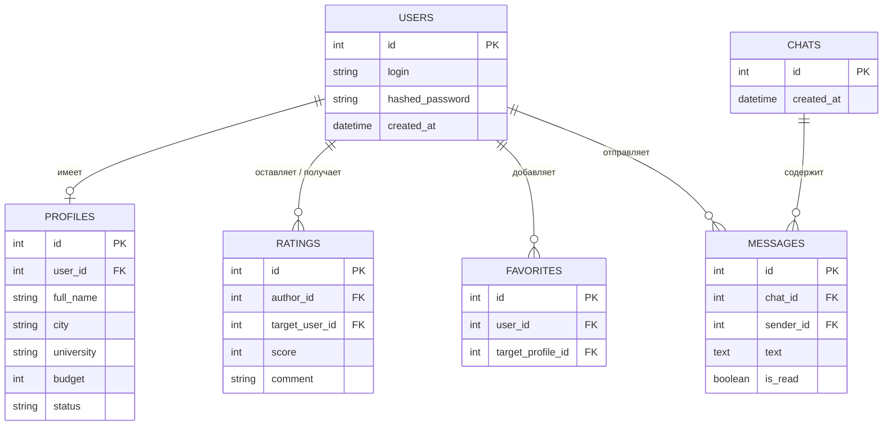

Требования к данным

4.1 Логическая модель данных 

База данных веб-сервиса состоит из 6 основных реляционных таблиц, обеспечивающих хранение аккаунтов, профилей, оценок, чатов и сообщений.

    
Связи между сущностями:

users (1) ── (1) profiles (Один пользователь имеет одну анкету)

users (1) ── (N) favorites (Один пользователь может добавить много анкет в избранное)

users (1) ── (N) ratings (Один пользователь может оставить и получить множество отзывов)

users (N) ── (N) chats (Пользователи объединены в личные диалоги)

chats (1) ── (N) messages (В одном чате находится множество сообщений)
