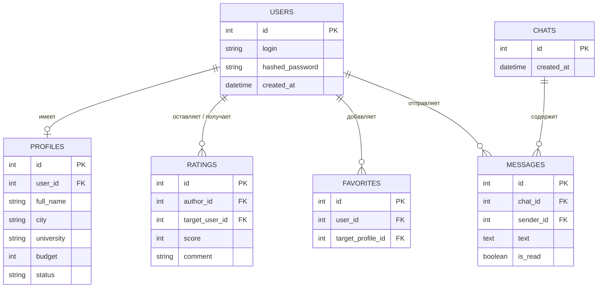

Требования к данным

4.1 Логическая модель данных 

База данных веб-сервиса состоит из 6 основных реляционных таблиц, обеспечивающих хранение аккаунтов, профилей, оценок, чатов и сообщений.

    
Связи между сущностями:

users (1) ── (1) profiles (Один пользователь имеет одну анкету)

users (1) ── (N) favorites (Один пользователь может добавить много анкет в избранное)

users (1) ── (N) ratings (Один пользователь может оставить и получить множество отзывов)

users (N) ── (N) chats (Пользователи объединены в личные диалоги)

chats (1) ── (N) messages (В одном чате находится множество сообщений)

4.2 Словарь данных (Структура таблиц)

1. Таблица `users` (Учетные записи)

| Поле | Тип данных | Ограничения | Описание |
| :--- | :--- | :--- | :--- |
| `id` | Integer | Primary Key, Autoincrement | Уникальный идентификатор пользователя |
| `login` | String | Unique, Not Null | Логин для входа в систему |
| `hashed_password` | String | Not Null | Захэшированный пароль (`bcrypt`) |
| `created_at` | DateTime | Default CURRENT_TIMESTAMP | Дата и время регистрации |

2. Таблица `profiles` (Анкеты пользователей)

| Поле | Тип данных | Ограничения | Описание |
| :--- | :--- | :--- | :--- |
| `id` | Integer | Primary Key, Autoincrement | Уникальный идентификатор анкеты |
| `user_id` | Integer | Foreign Key (`users.id`), Unique | Идентификатор владельца анкеты |
| `full_name` | String | Not Null | ФИО студента |
| `birth_date` | Date | Not Null | Дата рождения |
| `gender` | String | Not Null | Пол (`male`, `female`, `other`) |
| `city` | String | Not Null | Город поиска |
| `university` | String | Not Null | ВУЗ / Факультет |
| `budget` | Integer | Not Null | Планируемый бюджет (руб./мес) |
| `preferred_district` | String | Nullable | Предпочтительный район проживания |
| `smoking` | String | Not Null | Отношение к курению |
| `has_pets` | Boolean | Default False | Наличие домашних животных |
| `about` | Text | Nullable | О себе / дополнительные пожелания |
| `status` | String | Default `'active'` | Статус анкеты (`active`, `archived`) |
| `created_at` | DateTime | Default CURRENT_TIMESTAMP | Дата создания анкеты |

3. Таблица `ratings` (Рейтинг и отзывы)

| Поле | Тип данных | Ограничения | Описание |
| :--- | :--- | :--- | :--- |
| `id` | Integer | Primary Key, Autoincrement | Уникальный идентификатор отзыва |
| `author_id` | Integer | Foreign Key (`users.id`) | Кто оставляет отзыв |
| `target_user_id` | Integer | Foreign Key (`users.id`) | Кому оставляют отзыв |
| `score` | Integer | Check (1-5), Not Null | Итоговая оценка (от 1 до 5) |
| `cleanliness` | Integer | Check (1-5), Nullable | Оценка чистоплотности |
| `punctuality` | Integer | Check (1-5), Nullable | Оценка своевременности оплаты |
| `communication` | Integer | Check (1-5), Nullable | Оценка коммуникабельности |
| `comment` | Text | Nullable | Текстовый отзыв / комментарий |
| `created_at` | DateTime | Default CURRENT_TIMESTAMP | Дата публикации отзыва |

4. Таблица `favorites` (Избранные анкеты)

| Поле | Тип данных | Ограничения | Описание |
| :--- | :--- | :--- | :--- |
| `id` | Integer | Primary Key, Autoincrement | Уникальный ID записи |
| `user_id` | Integer | Foreign Key (`users.id`) | Пользователь, добавивший в избранное |
| `target_profile_id` | Integer | Foreign Key (`profiles.id`) | Сохраняемая анкета |
| `created_at` | DateTime | Default CURRENT_TIMESTAMP | Дата добавления |

5. Таблица `chats` (Личные диалоги)

| Поле | Тип данных | Ограничения | Описание |
| :--- | :--- | :--- | :--- |
| `id` | Integer | Primary Key, Autoincrement | Уникальный ID чата |
| `created_at` | DateTime | Default CURRENT_TIMESTAMP | Дата создания диалога |

6. Таблица `messages` (Сообщения)

| Поле | Тип данных | Ограничения | Описание |
| :--- | :--- | :--- | :--- |
| `id` | Integer | Primary Key, Autoincrement | Уникальный ID сообщения |
| `chat_id` | Integer | Foreign Key (`chats.id`) | Идентификатор чата |
| `sender_id` | Integer | Foreign Key (`users.id`) | Отправитель сообщения |
| `text` | Text | Not Null | Текст сообщения |
| `is_read` | Boolean | Default False | Статус прочтения |
| `created_at` | DateTime | Default CURRENT_TIMESTAMP | Дата и время отправки |

4.3 Получение, целостность, хранение и утилизация данных

Целостность данных:

Обеспечивается использованием внешних ключей (FOREIGN KEY) с каскадным удалением или ограничением удаления (ON DELETE CASCADE / RESTRICT).

Проверка корректности полей (диапазон оценок 1–5, уникальность комбинаций логинов и избранного) на уровне базы данных и схем валидации Pydantic.

Хранение данных:

Все пароли хранятся в виде хэшей bcrypt.

Даты сохраняются в формате UTC ISO 8601.

Утилизация и удаление:

При удалении пользователем анкеты применяется механизм мягкого удаления (status = 'archived'), что позволяет сохранить историю сообщений и рейтингов.

Полное удаление аккаунта со всеми персональными данными производится по запросу с физическим удалением записей из каскадных таблиц.

