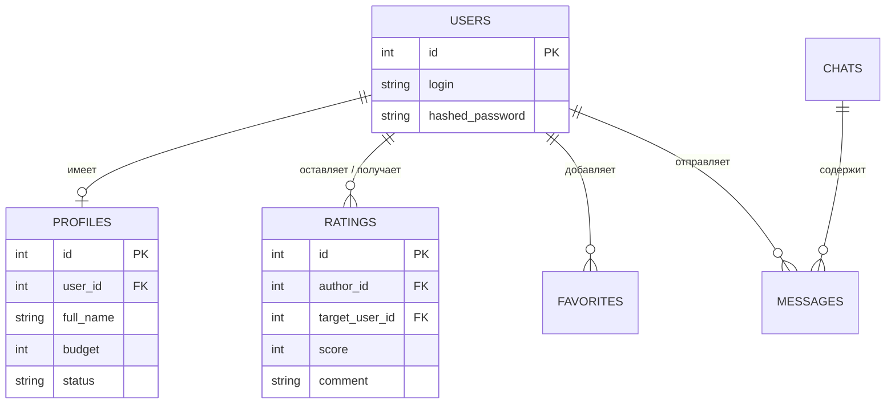

```mermaid
erDiagram
    USERS ||--o| PROFILES : "имеет"
    USERS ||--o{ RATINGS : "оставляет / получает"
    USERS ||--o{ FAVORITES : "добавляет"
    USERS ||--o{ MESSAGES : "отправляет"
    CHATS ||--o{ MESSAGES : "содержит"

    USERS {
        int id PK
        string login
        string hashed_password
    }
    PROFILES {
        int id PK
        int user_id FK
        string full_name
        int budget
        string status
    }
    RATINGS {
        int id PK
        int author_id FK
        int target_user_id FK
        int score
        string comment
    }
```
