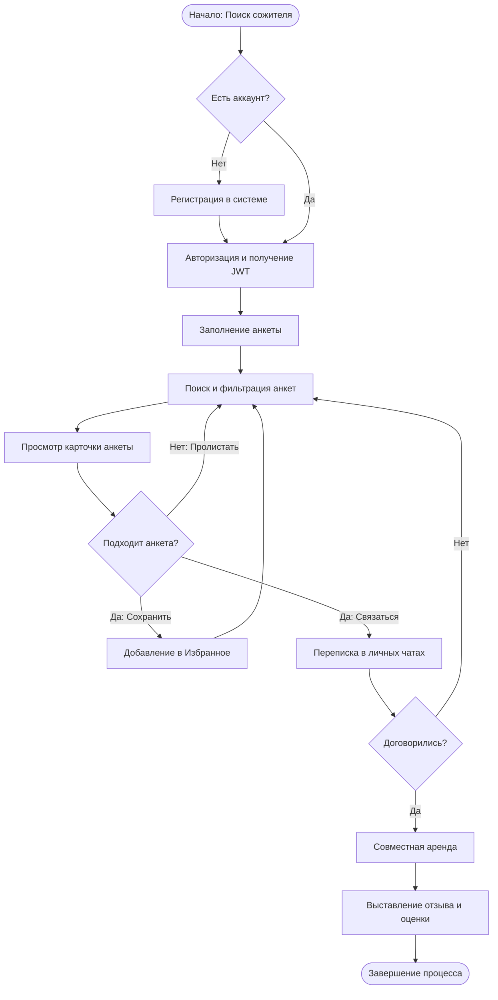

```mermaid
flowchart TD
    Start([Начало: Поиск сожителя]) --> AuthCheck{Есть аккаунт?}

    AuthCheck -- Нет --> Register[Регистрация в системе]
    Register --> Login[Авторизация и получение JWT]
    AuthCheck -- Да --> Login

    Login --> CreateProfile[Заполнение анкеты]
    CreateProfile --> Search[Поиск и фильтрация анкет]

    Search --> ViewCard[Просмотр карточки анкеты]
    ViewCard --> Found{Подходит анкета?}

    Found -- Нет: Пролистать --> Search
    Found -- Да: Сохранить --> SaveFav[Добавление в Избранное]
    SaveFav --> Search
    Found -- Да: Связаться --> Chat[Переписка в личных чатах]

    Chat --> Agree{Договорились?}

    Agree -- Нет --> Search
    Agree -- Да --> CoRent[Совместная аренда]

    CoRent --> Rate[Выставление отзыва и оценки]
    Rate --> End([Завершение процесса])
```
